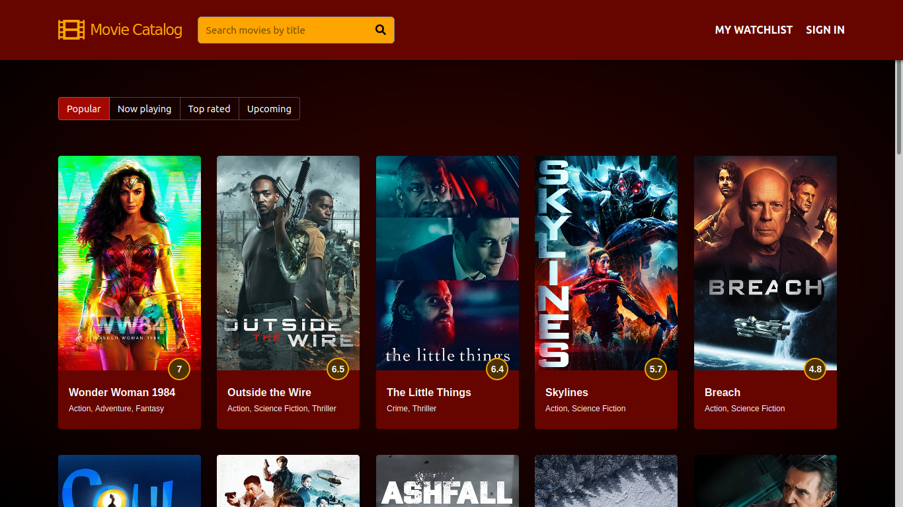

# Movie Catalog [WORK IN PROGRESS]

_Find your next movie or create your watchlist with this React web app_



## How to run

To clone and run this application, you'll need Git, Node.js and NPM installed on your computer. From your command line:

```bash
# Clone this repository
$ git clone https://github.com/westgoten/movie-catalog.git

# Go into the repository
$ cd movie-catalog

# Install dependencies
$ npm install

# Start local server
$ npm start
```


## Libs & Frameworks

-   [React](https://reactjs.org/)
-   [React Router](https://reactrouter.com/)
-   [Redux](https://redux.js.org/)
-   [React Redux](https://react-redux.js.org/)
-   [Axios](https://github.com/axios/axios)
-   [Font Awesome](https://fontawesome.com/)

## License

Read about license rights and limitations [here](LICENSE).
